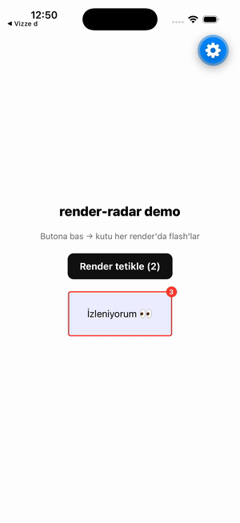

# render-radar

[](https://www.npmjs.com/package/render-radar)
[](./LICENSE)

> Dev-only re-render visualizer for React Native. Wrap a component and watch it
> **flash + count** every time it re-renders. No Flipper, no native setup, no
> config. Ships nothing to production.



## Why

`memo`, `useCallback` and `useMemo` only help if you know _what_ is actually
re-rendering. Flipper is deprecated and React DevTools' "highlight updates" is
awkward on React Native. `render-radar` gives you an in-app, zero-config answer:
a flashing border and a live counter on any component you point it at.

## Install

```bash
npm i -D render-radar
```

## Usage

### `<RenderRadar>` — visual (flash + counter)

Wrap any component. In dev it draws a flashing border and a render counter; in
production it renders `children` and nothing else.

```tsx
import { RenderRadar } from 'render-radar';

<RenderRadar name="ProductCard">
  <ProductCard {...props} />
</RenderRadar>;
```

Props:

| Prop       | Type        | Default     | Description                         |
| ---------- | ----------- | ----------- | ----------------------------------- |
| `name`     | `string`    | —           | Label used in logs / future panel.  |
| `color`    | `string`    | `'#ff3b30'` | Border + badge color.               |
| `children` | `ReactNode` | —           | The subtree to watch.               |

### `useRenderRadar` — the count, in your own hands

Returns how many times the component has rendered. Pass `{ log: true }` to also
print to the console.

```tsx
import { useRenderRadar } from 'render-radar';

function ProductCard(props) {
  const renderCount = useRenderRadar('ProductCard', { log: true });
  // ...
}
```

## Production safety

Every API checks `__DEV__`. In a release build (`__DEV__ === false`):

- `<RenderRadar>` renders only `children` — no wrapper `View`, no overlay.
- `useRenderRadar` records nothing and never logs.

## API

- `<RenderRadar name color? children>` — wraps children, shows flash + counter on render.
- `useRenderRadar(name, { log? }): number` — current render count.
- `renderStore` — the underlying store (advanced / future tooling).

## License

MIT
